# 学习记录

## F1 如何科学地提问

一、 在提问前先准备好一下三个方面

- "搜搜友好的网络"(STFW)：当你得到一个关键词的话，你就可以通过搜索引擎去搜索一下关键粗
- "读读友好的手册"(RTFM)：如果软件或者工具有手册（手册一般在官网，你通过“STFW”，找到这个官网）你应该先去阅读一下他们手册。或者去对应的github仓库查看一下大家提的issue，是否有和自己同类型的问题；
- "读读友好的源代码"(RTFSC)：应该尝试去读一下它们的源代码；

二、如何正确描述问题？

1. 环境（操作系统类型、一些关键的软件的版本等等）；
2. 做了什么操作导致出现了这个问题；
3. 错误的表现是什么样式的；
4. 最好带上截图，可以的话截图中圈出关键点；
5. 也可以补充一些提这个问题的目的；（因为很多初学者不是能很好的意识到这个到底是不是一个问题）

提问模板：https://ysyx.oscc.cc/docs/2205/misc/ask.html

## F2 Logisim

我下载的时候默认是中文，所以看起来会比较轻松，如果遇到不会的，优先去帮助里面查看文档，我们称之为STFW。

### 快捷键

### 数电和模电

自行复习

## F3 数字逻辑电路基础

### 晶体管

常用的晶体管是 金属-氧化物-半导体场效应晶体管，简称MOS管，MOS管有分为nMOS(Negative)和pMOS(Positive)，它们都有三个接口，分别是栅极(gete)，源极(source)和漏极(drain)。晶体管是一个特殊的开关, 它是由电路中的电压来控制的. 通过控制MOS管栅极的电压, 来控制其源极和漏极是否连通。

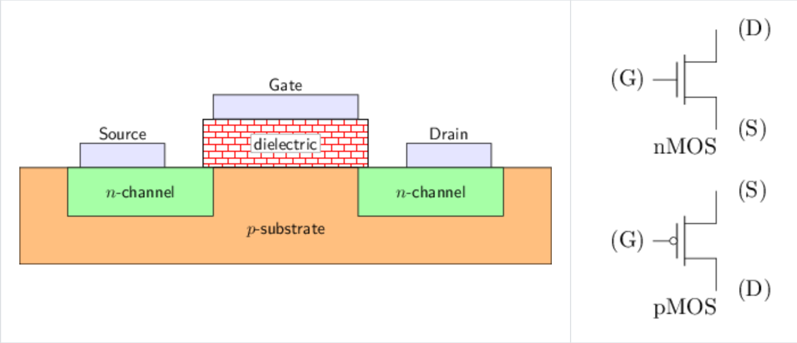

nMOS功能

- 当栅极电压与源极电压之间的差值(V~G~-V~S~)较大时，源极和漏极导通，相当于开关闭合
- 当栅极电压与源极电压之间的差值(V~G~-V~S~)较小时，源极和漏极截止，相当于开关断开

pMOS功能表现与nMOS类似，V~S~-V~G~较大时导通，V~S~-V~G~较小时截止。

由于nMOS和pMOS具有互补的特性，在数字电路中通常将两者联合使用，称为CMOS技术：

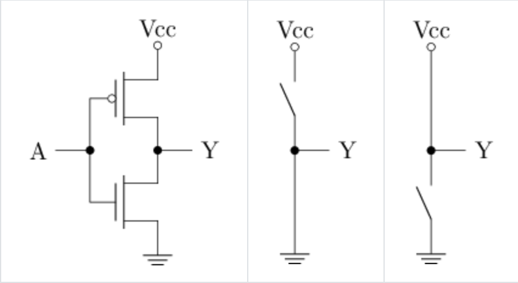

- 在A点加高电压时, 下方的n管(nMOS)导通, 上方的p管(pMOS)截止, 相当于Y点与地相连(中图), Y点电压低
- 在A点加低电压时, 下方的n管(nMOS)截止, 上方的p管(pMOS)导通, 相当于Y点与电源相连(右图), Y点电压高

因此可以看到，CMOS电路将n管和p管的开关特性转换成了电路输出电压的高低，将物理上的高电压定义为逻辑1

(高电平)，低电压定义为逻辑0(低电平)，于是便得到了数字电路中信号的两种基本状态。

### 通过晶体管搭建门电路

#### 非门（反相器）

上面提到的CMOS电路就是一个非门，当A输出为1的时候，Y输出为0；当A输出为0的时候，Y输出为1；

#### 与非门

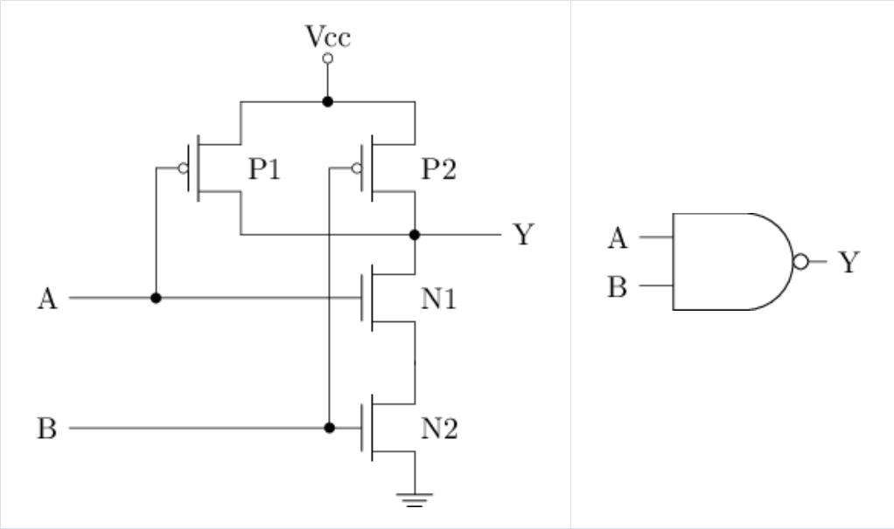

P1和P2并联，N1和N2串联，所以P1和P2只要以一个导通时，Y就为1，N1和N2需要两个都导通时才为0

只有当两个输出都为1的时候，电路才会输出0，否则输出1。

#### 与门

将与非门的输出再连接一个非门就是与门

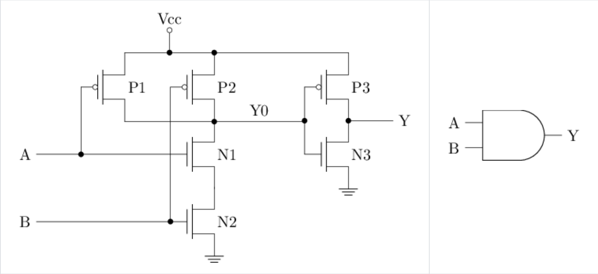

#### 或门

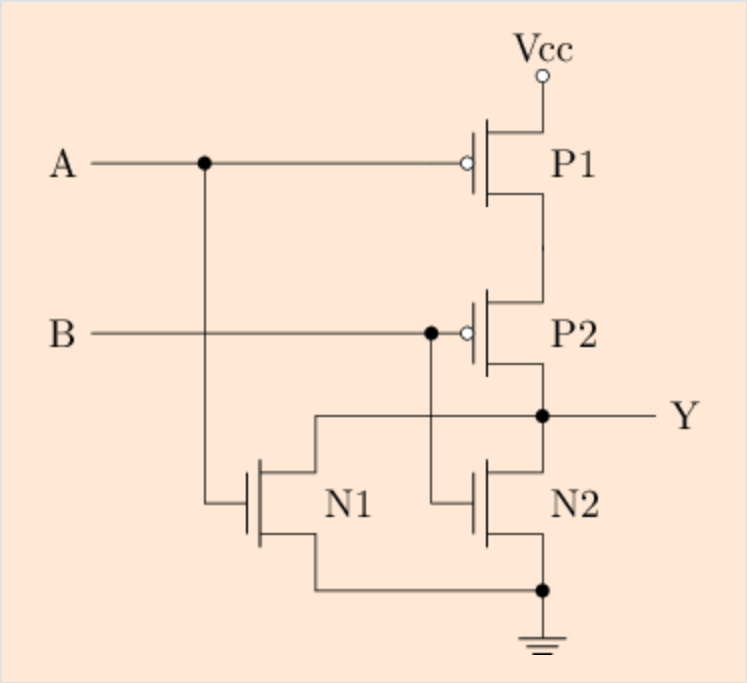

上面的电路图，在他的后面加上一个非门即可变成或门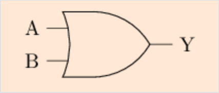

#### 全定制电路：通过晶体管设计电路

在晶体管层次设计的电路称为全定制电路，通过三输入与非门的例子，我们可以看到，全定制电路所需要的晶体管的数量更少，因此电路面积也更小，在实际生产中，出了面积更小之外，全定制电路的主频也更高，功耗更低。

但是, 全定制电路的设计难度大, 开发周期也很长. 现代处理器芯片包含动辄上亿个晶体管, 全部使用全定制电路来开发是不现实的. 对于超大规模集成电路的设计, 更常见的是采用的是半定制电路设计方法.

半定制电路的设计又分为基于标准单元的设计方法和基于门阵列的设计方法. 前者是预先用全定制方式设计出一些常用的逻辑单元, 例如与门、或门、触发器等, 这些逻辑单元称为标准单元; 然后再通过这些标准单元构建出大规模电路. 回到上面三输入与非门的例子, 如果把两输入的与门和两输入的与非门看成是标准单元, 那么通过它们搭建三输入与非门就可以看成是半定制电路的设计方法. 至于基于门阵列的设计方法, 一个常见的例子是FPGA. 

#### 异或门

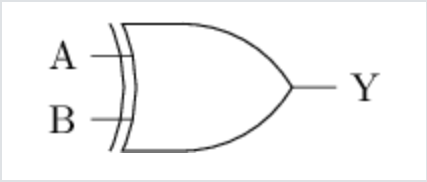

异或门只有当连哥哥输入信号不同时，输出才为高电平，如果两个输入相同，输出则为低电平。

- 异或的“异”表示“不同”，因此当输入A和B不同时，结果为1，否则为0.
- 或运算表示两个输入中至少一个为1，和或运算不同，异或运算排除了两个输入均为1的情况，因此也成为“排斥或”，其中的“排斥”和英文exclusive对应，相对地，或运算也称为“相容或”，表示允许两个输入均为1。

异或门的全定制电路

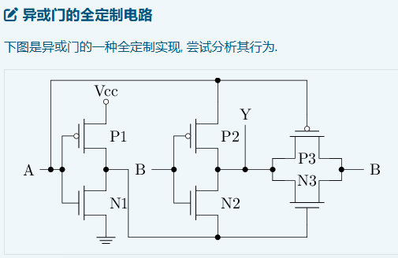

接线图：test04

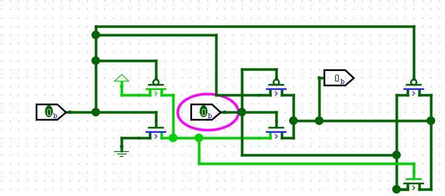

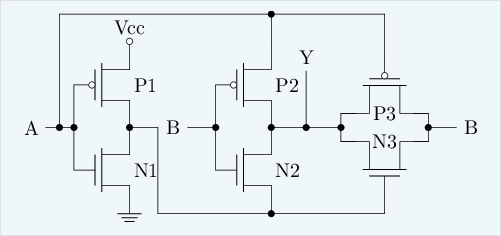

异或门电路解析：只使用6个晶体管

我们把整个电路图分为三部分，如图左半边输出：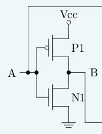、中间输出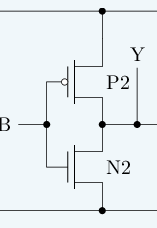，右半边输出：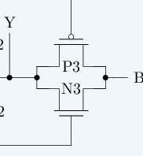

左边提供了A/~A，中间电路重要完成当A/B不同时输出为1，通过将B与A和非A进行比较，控制开关，实现对A/B输出不同时，Y输出为1。右边电路实现A/B相同时，输出为0，左边的电路当A/B相同的时候是不接通输出到Y的电路的，右边的电路和中间的电路是一样的，只是晶体管的栅极和源极之间的输入与中间调换了一下，实现A/B相同输出0的道理，

#### 同或门

test06即对上面异或门的输出再接一个非门电路

六个晶体管的全定制实现：

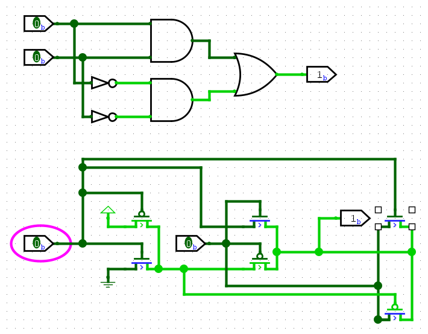

这里的同或门把右边两部门的p/n晶体管换个位置

### 化简算法

#### 1. QMC 算法 (Quine-McCluskey Method)

QMC 算法也被称为“表格法”，它是第一个能够通过计算机编程实现并**保证找到最优解**的化简算法。

##### 工作流程：

1. **分组**：将所有最小项（Minterms）按照包含“1”的个数进行分组。
2. **寻找质蕴涵项 (Prime Implicants)**：
   - 比较相邻组的项，如果只有一位不同，则合并，并用横杠 `-` 代替变化的那一位。
   - 重复此过程，直到无法再合并为止。剩下的项就是“质蕴涵项”。
3. **构建质蕴涵表 (PI Chart)**：
   - 列出所有最小项和所有找到的质蕴涵项。
   - 找出**必须包含**的项（必要质蕴涵项，EPI），它们覆盖了那些没有其他项能覆盖的最小项。
4. **选择最小覆盖**：用最少的质蕴涵项覆盖剩下的所有最小项。

##### 优缺点：

- **优点**：能保证得到逻辑最简式（最优解）。
- **缺点**：随着变量增加，计算量呈指数级增长（NP-complete 问题），处理超过 10 个变量时速度极慢。

------

#### 2. Espresso 算法

Espresso 是一种**启发式（Heuristic）**算法，由 UC Berkeley 开发。它是工业界（如 EDA 工具、FPGA 编译器）的实际标准。

##### 核心思想：

它不像 QMC 那样枚举所有可能性，而是通过**迭代优化**来快速逼近最优解。它不保证 100% 找到“绝对最简”，但在 99.9% 的情况下能找到非常接近最优且足够好的解，而且速度极快。

##### 关键步骤 (Reduce-Expand-Irredundant)：

1. **Expand（展开）**：尝试把现有的积项变大（把 0 或 1 变成 `-`），目的是覆盖更多的 1，从而减少总项数。
2. **Irredundant（去冗余）**：删除那些已经被其他项覆盖掉的多余项。
3. **Reduce（收缩）**：将现有的项尽量缩小，腾出空间，以便在下一轮“展开”中尝试不同的方向，跳出局部最优解。

##### 优缺点：

- **优点**：处理能力强，可以轻松处理几十个甚至上百个变量的复杂逻辑。
- **缺点**：在极少数极端情况下，结果可能不是数学上的绝对最简。

### 进位计数法

十进制、二进制、十六进制...

### 门电路搭建基本组合逻辑电路

#### 译码器

一个2-4译码器

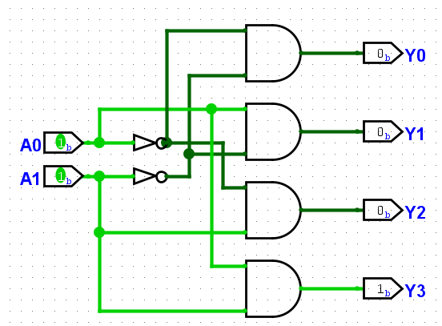

##### 译码器的扩展

3-8译码器有3位输入, 8位输出. 尝试实例化若干个2-4译码器(具体数量交给你的思考), 并添加少量门电路, 从而实现3-8译码器的功能

分析：将两个2-4译码器分别作为高四位和低四位的输出，将两个输入分别接入，再额外加一个控制何时读取高四位和低四位，加一个控制，与门来控制选中高四位还是低四位。

接线图：

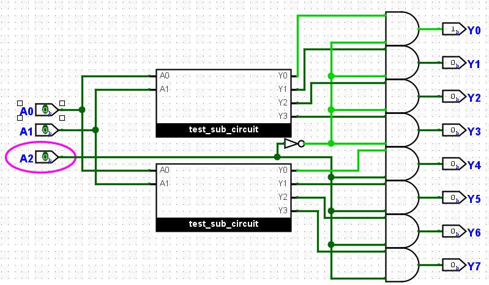

#### 转码器

它可以按照指定的规则将一种编码的输入转换成另一种编码的输出，和n选1译码器不同，转码器不要求输出中最多包含1个1。

转码器的一个常见应用是七段数码管译码器(7-segment decoder). 七段数码管是一个由7段发光二极管按"8"字型排列组成的输出元件，图中用字母a-g分别标识每一段发光二极管的位置, 只要某控制信号有效, 相应的发光二极管就会被点亮. 图中还有一个用h标识的小数点, 在一些需要使用小数的场景会使用.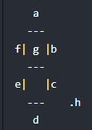

