# 学习记录

## F1 如何科学地提问

一、 在提问前先准备好一下三个方面

- "搜搜友好的网络"(STFW)：当你得到一个关键词的话，你就可以通过搜索引擎去搜索一下关键粗
- "读读友好的手册"(RTFM)：如果软件或者工具有手册（手册一般在官网，你通过“STFW”，找到这个官网）你应该先去阅读一下他们手册。或者去对应的github仓库查看一下大家提的issue，是否有和自己同类型的问题；
- "读读友好的源代码"(RTFSC)：应该尝试去读一下它们的源代码；

二、如何正确描述问题？

1. 环境（操作系统类型、一些关键的软件的版本等等）；
2. 做了什么操作导致出现了这个问题；
3. 错误的表现是什么样式的；
4. 最好带上截图，可以的话截图中圈出关键点；
5. 也可以补充一些提这个问题的目的；（因为很多初学者不是能很好的意识到这个到底是不是一个问题）

提问模板：https://ysyx.oscc.cc/docs/2205/misc/ask.html

## F2 Logisim

我下载的时候默认是中文，所以看起来会比较轻松，如果遇到不会的，优先去帮助里面查看文档，我们称之为STFW。

### 快捷键

### 数电和模电

自行复习

## F3 数字逻辑电路基础

### 晶体管

常用的晶体管是 金属-氧化物-半导体场效应晶体管，简称MOS管，MOS管有分为nMOS(Negative)和pMOS(Positive)，它们都有三个接口，分别是栅极(gete)，源极(source)和漏极(drain)。晶体管是一个特殊的开关, 它是由电路中的电压来控制的. 通过控制MOS管栅极的电压, 来控制其源极和漏极是否连通。

nMOS功能

- 当栅极电压与源极电压之间的差值(V~G~-V~S~)较大时，源极和漏极导通，相当于开关闭合
- 当栅极电压与源极电压之间的差值(V~G~-V~S~)较小时，源极和漏极截止，相当于开关断开

pMOS功能表现与nMOS类似，V~S~-V~G~较大时导通，V~S~-V~G~较小时截止。

由于nMOS和pMOS具有互补的特性，在数字电路中通常将两者联合使用，称为CMOS技术：

- 在A点加高电压时, 下方的n管(nMOS)导通, 上方的p管(pMOS)截止, 相当于Y点与地相连(中图), Y点电压低
- 在A点加低电压时, 下方的n管(nMOS)截止, 上方的p管(pMOS)导通, 相当于Y点与电源相连(右图), Y点电压高

因此可以看到，CMOS电路将n管和p管的开关特性转换成了电路输出电压的高低，将物理上的高电压定义为逻辑1

(高电平)，低电压定义为逻辑0(低电平)，于是便得到了数字电路中信号的两种基本状态。

### 通过晶体管搭建门电路

#### 非门（反相器）

上面提到的CMOS电路就是一个非门，当A输出为1的时候，Y输出为0；当A输出为0的时候，Y输出为1；

#### 与非门

P1和P2并联，N1和N2串联，所以P1和P2只要以一个导通时，Y就为1，N1和N2需要两个都导通时才为0

只有当两个输出都为1的时候，电路才会输出0，否则输出1。

#### 与门

将与非门的输出再连接一个非门就是与门

#### 或门

上面的电路图，在他的后面加上一个非门即可变成或门

#### 全定制电路：通过晶体管设计电路

在晶体管层次设计的电路称为全定制电路，通过三输入与非门的例子，我们可以看到，全定制电路所需要的晶体管的数量更少，因此电路面积也更小，在实际生产中，出了面积更小之外，全定制电路的主频也更高，功耗更低。

但是, 全定制电路的设计难度大, 开发周期也很长. 现代处理器芯片包含动辄上亿个晶体管, 全部使用全定制电路来开发是不现实的. 对于超大规模集成电路的设计, 更常见的是采用的是半定制电路设计方法.

半定制电路的设计又分为基于标准单元的设计方法和基于门阵列的设计方法. 前者是预先用全定制方式设计出一些常用的逻辑单元, 例如与门、或门、触发器等, 这些逻辑单元称为标准单元; 然后再通过这些标准单元构建出大规模电路. 回到上面三输入与非门的例子, 如果把两输入的与门和两输入的与非门看成是标准单元, 那么通过它们搭建三输入与非门就可以看成是半定制电路的设计方法. 至于基于门阵列的设计方法, 一个常见的例子是FPGA. 

#### 异或门

异或门只有当连哥哥输入信号不同时，输出才为高电平，如果两个输入相同，输出则为低电平。

- 异或的“异”表示“不同”，因此当输入A和B不同时，结果为1，否则为0.
- 或运算表示两个输入中至少一个为1，和或运算不同，异或运算排除了两个输入均为1的情况，因此也成为“排斥或”，其中的“排斥”和英文exclusive对应，相对地，或运算也称为“相容或”，表示允许两个输入均为1。

异或门的全定制电路

接线图：test04

异或门电路解析：只使用6个晶体管

我们把整个电路图分为三部分，如图左半边输出：、中间输出，右半边输出：

左边提供了A/~A，中间电路重要完成当A/B不同时输出为1，通过将B与A和非A进行比较，控制开关，实现对A/B输出不同时，Y输出为1。右边电路实现A/B相同时，输出为0，左边的电路当A/B相同的时候是不接通输出到Y的电路的，右边的电路和中间的电路是一样的，只是晶体管的栅极和源极之间的输入与中间调换了一下，实现A/B相同输出0的道理，

#### 同或门

test06即对上面异或门的输出再接一个非门电路

六个晶体管的全定制实现：

这里的同或门把右边两部门的p/n晶体管换个位置

### 化简算法

#### 1. QMC 算法 (Quine-McCluskey Method)

QMC 算法也被称为“表格法”，它是第一个能够通过计算机编程实现并**保证找到最优解**的化简算法。

##### 工作流程：

1. **分组**：将所有最小项（Minterms）按照包含“1”的个数进行分组。
2. **寻找质蕴涵项 (Prime Implicants)**：
   - 比较相邻组的项，如果只有一位不同，则合并，并用横杠 `-` 代替变化的那一位。
   - 重复此过程，直到无法再合并为止。剩下的项就是“质蕴涵项”。
3. **构建质蕴涵表 (PI Chart)**：
   - 列出所有最小项和所有找到的质蕴涵项。
   - 找出**必须包含**的项（必要质蕴涵项，EPI），它们覆盖了那些没有其他项能覆盖的最小项。
4. **选择最小覆盖**：用最少的质蕴涵项覆盖剩下的所有最小项。

##### 优缺点：

- **优点**：能保证得到逻辑最简式（最优解）。
- **缺点**：随着变量增加，计算量呈指数级增长（NP-complete 问题），处理超过 10 个变量时速度极慢。

------

#### 2. Espresso 算法

Espresso 是一种**启发式（Heuristic）**算法，由 UC Berkeley 开发。它是工业界（如 EDA 工具、FPGA 编译器）的实际标准。

##### 核心思想：

它不像 QMC 那样枚举所有可能性，而是通过**迭代优化**来快速逼近最优解。它不保证 100% 找到“绝对最简”，但在 99.9% 的情况下能找到非常接近最优且足够好的解，而且速度极快。

##### 关键步骤 (Reduce-Expand-Irredundant)：

1. **Expand（展开）**：尝试把现有的积项变大（把 0 或 1 变成 `-`），目的是覆盖更多的 1，从而减少总项数。
2. **Irredundant（去冗余）**：删除那些已经被其他项覆盖掉的多余项。
3. **Reduce（收缩）**：将现有的项尽量缩小，腾出空间，以便在下一轮“展开”中尝试不同的方向，跳出局部最优解。

##### 优缺点：

- **优点**：处理能力强，可以轻松处理几十个甚至上百个变量的复杂逻辑。
- **缺点**：在极少数极端情况下，结果可能不是数学上的绝对最简。

### 进位计数法

十进制、二进制、十六进制...

### 门电路搭建基本组合逻辑电路

#### 译码器

一个2-4译码器

##### 译码器的扩展

3-8译码器有3位输入, 8位输出. 尝试实例化若干个2-4译码器(具体数量交给你的思考), 并添加少量门电路, 从而实现3-8译码器的功能

分析：将两个2-4译码器分别作为高四位和低四位的输出，将两个输入分别接入，再额外加一个控制何时读取高四位和低四位，加一个控制，与门来控制选中高四位还是低四位。

接线图：

#### 转码器

它可以按照指定的规则将一种编码的输入转换成另一种编码的输出，和n选1译码器不同，转码器不要求输出中最多包含1个1。

转码器的一个常见应用是七段数码管译码器(7-segment decoder). 七段数码管是一个由7段发光二极管按"8"字型排列组成的输出元件，图中用字母a-g分别标识每一段发光二极管的位置, 只要某控制信号有效, 相应的发光二极管就会被点亮. 图中还有一个用h标识的小数点, 在一些需要使用小数的场景会使用.

电路图解析：

使用了两个前面搭建了3-8译码器，搭建了一个4输入16输出的译码器，搭建方式和2-4搭3-8原理一致

具体电路图：

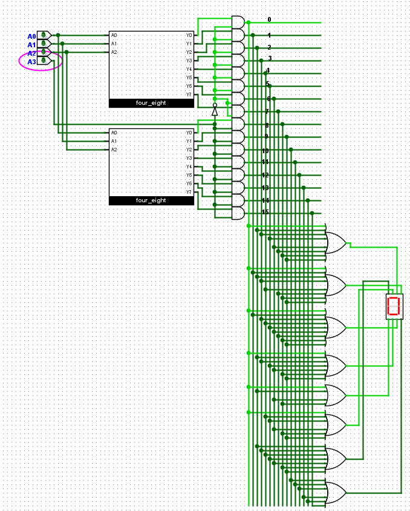

搭建七段数码管编码器2：

原理同上：

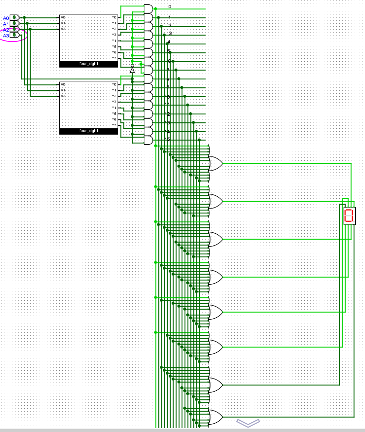

#### 编码器

编码器的功能和n选1译码器相反，它用于将独热码转换成相应的二进制数值。

在Logisim中通过门电路搭建一个16-4编码器, 它有16位输入和4位输出, 分别与拨码开关和七段数码管译码器相连, 使得编码器的输出结果通过十六进制数字显示在七段数码管中
电路图：

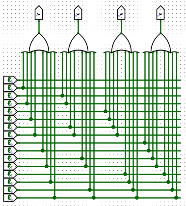

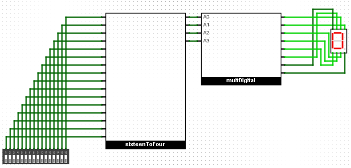

其中未展示的multDigital是前面搭建的七段数码管电路。

##### 优先编码器

上述编码器要求使用者保证输入是独热码, 如果希望在输入不为独热码的时候仍然输出有效的信息, 则需要使用另一种编码器——优先编码器(priority encoder).

搭建4-2优先编码器，电路图：左边是优先编码器，右边是普通编码器

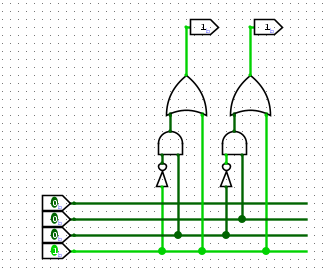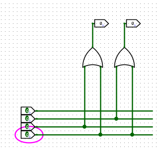

对比4-2编码器和4-2优先编码器，可以发现，4-2优先编码器相较于普通编码器而言，需要多两个与门和两个或门，以此来实现输入不必强求为标准的独热码。

##### 优先编码器的扩展

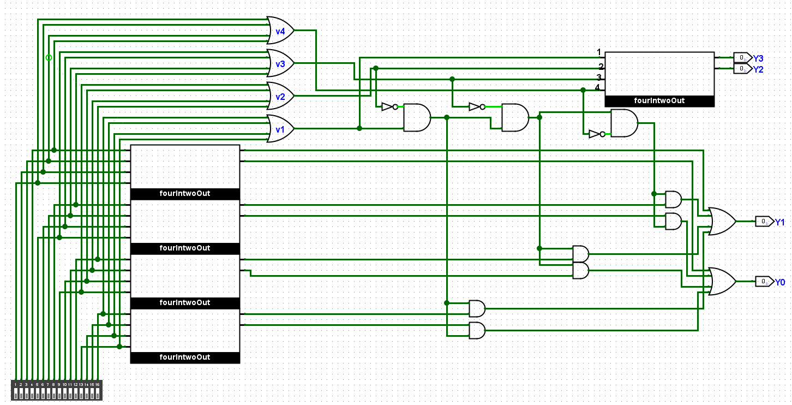

电路解析，整体思路位先实现16-4的编码器，先选用四个4-2优先编码器，连接它们的输出到一个四输出的或门，这样即可实现低两位的控制，高四位的实现在于通过一个标志位，或门输出，来标识哪一个4-2编码器被激活，从而实现对高两位的控制。

细节实现：

1. **输入组编码层 (第一级)**

- 使用了 **4个 `four Intwo Out` 模块** 接收16位拨码开关信号。
- 每个模块负责4位输入，并独立生成该组内的 2-bit 编码结果。
- **关键点：** 通过外部的 4 输入或门（标记为 **v1, v2, v3, v4**）提取了每一组的**有效信号（Valid）**。

2. **组间优先级拦截逻辑**

这就是让电路从“普通编码”升华为“优先编码”的关键：

- **逻辑门实现：** 在电路中间使用了**非门**和**与门**链。
- **屏蔽机制：**  **v1**（假设为最高位组）的信号直接去封锁 **v2, v3, v4** 的路径。
  - 只有当 **v1=0** 时，第二组的信号才能通过；只有当 **v1, v2** 同时为 **0** 时，第三组才能通过。
- **结果：** 这一层确保了**同一时间只有优先级最高的那一组 Y1, Y0 能够到达最后的输出或门**。其他低优先级的信号都被与门强制转成了 `00`，彻底解决“信号叠加”问题。

3. **高位生成与最终汇总**

- **高两位 ($Y_3, Y_2$)：** 将 **v1 ~ v4** 接入了第五个 4-2 模块。这个模块的输出直接代表了“哪一组在工作”，即 16 位编码中的高两位。
- **低两位 ($Y_1, Y_0$)：** 经过拦截逻辑过滤后的 4 组低位信号，通过最后两个**大或门**进行汇总。
- **最终输出：** 此时的 4 位输出（**Y3, Y2** 拼接上汇总后的 **Y1, Y0**）就是完美的 16-4 优先编码结果。

##### 前导0和前导1的计数

优先编码器本质上就是一个“寻找第一个1的电路”

计算“前导0”：优先编码器会输出最高优先级（最高位）的1所在的索引，然后用15-k即可计算出前导0的数量。

计算“前导1”：逻辑基本相同，只是在把16位的数据输入个16-4的优先编码器的时候先进行取反操作，后续操作相同，数量也是15-k。

#### 多路选择器

多路选择器可以根据控制端的输入来从多个数据端中选择一路进行输出. 多路选择器也称"多路复用器", 或简称"选择器". 最简单的选择器是"1位2选1选择器", 它可以根据控制端的输入从两路1位的数据中选择一路进行输出.

当S输入为0时，选择走D0，当输入为1时，选择走D1.

##### 搭建1位2选1选择器

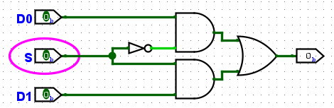

在计算机中，选择器是使用频率很高的元件，因为计算机的本质是用于处理数据，而数据的来源和处理方式都很多，因此需要大量的选择器来对数据来源和处理结果进行选择。

##### 搭建3位4选1选择器

线路图：

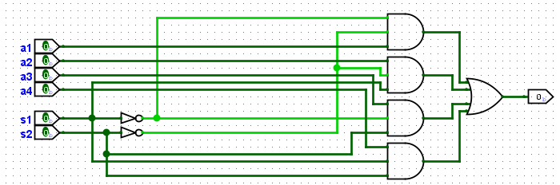

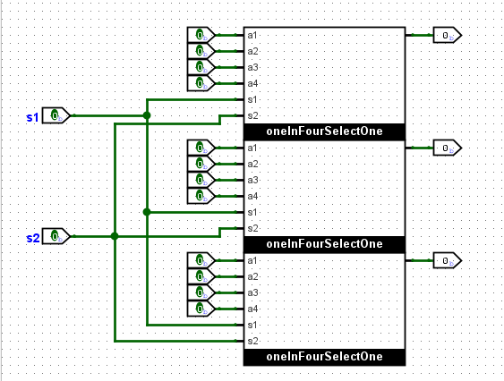

解析：上面的线路图作为一个子线路，主要完成1位4选1，主线路中，放置三个1位4选1并联，从而实现3位4选1选择器

##### 重点：

深入拆解：3位4选1选择器

在数字电路中，一个选择器的名字由两个核心维度组成：“选择能力”和“数据宽度”

“4选1”：代表逻辑功能（选哪路？）

- 输入组数：共有4组待选信号
- 选择信号（S线）：需要2位控制位(S1、S0)，因为2x2=4，这两位二进制数正好能产生00、01、10、11四种状态，分别对应4路输入
- 逻辑本质：它本质上是一个”多路开关“，决定哪一个通道的数据可以通往重点

”3位“：代表数据宽度（路有多宽？）

- 单组宽度：每一组输入信号不是1根线，而是3根线
- 同步性：当你选择”第1路“时，这3根线上的信号会同时被传送到输出端

###### 如何判断是”几位几选几“

**第一步：看“选几”——数输入组数**

看输入端被分成了多少个**独立的选项**。

- 有 2 组输入 -> **2选1**
- 有 4 组输入 ->  **4选1**
- 有 8 组输入 ->  **8选1**

> **小技巧**：看选择信号（Select）有几根。如果有 n 根选择线，那么通常就是 2^n 选 1。

**第二步：看“几位”——数每组的线数**

看**每一个选项**由几根线组成。

- 每个选项只有 1 根线  -> **1位**（Bit）
- 每个选项有 8 根线（总线） ->  **8位**
- 在仿真软件（如 Logisim）中，看连线的粗细：细线通常是 1 位，粗线是多位总线。

**第三步：组合名称**

公式：**[每组的位数] 位 [总组数] 选 1**。

##### 搭建可切换进位计数值的七段数码管

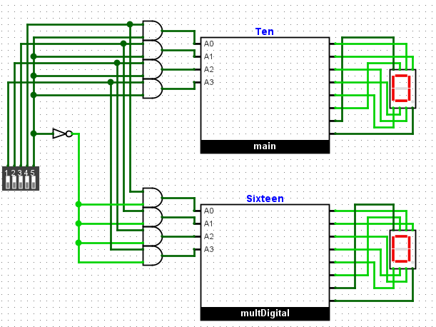

前四位1，2，3，4控制七段晶体管输出，5位信号用于控制选择哪一个显示，当开关S断开，即置零时选择十六进制显示，当开关闭合时，即置一时选择十进制显示。

#### 比较器

比较器用于检查两个输入的每一位是否完全一致. 由于异或门(和同或门)已经具备比较1位数据的功能, 因此可通过异或门(和同或门)搭建多位数据的比较器. 

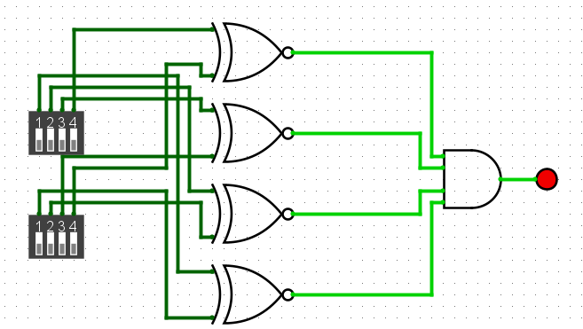

当两组输入数据相等时，点亮LED灯。

#### 加法器

全加器，输入有进位的加法器；半加器，输入无进位的加法器。

##### 搭建1位全加器

真值表：

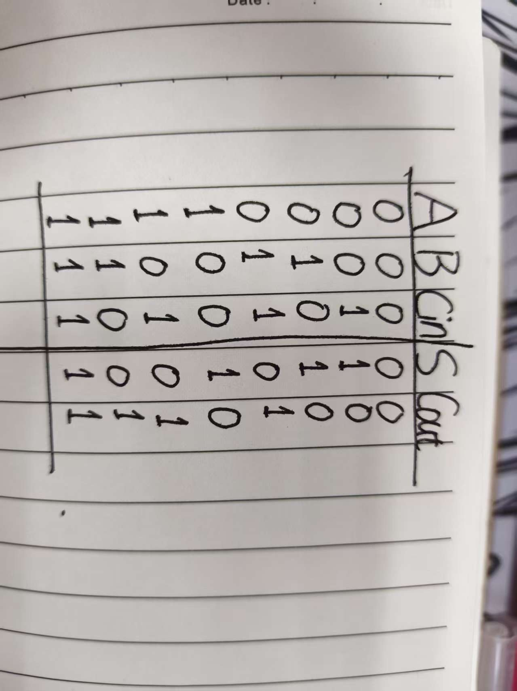

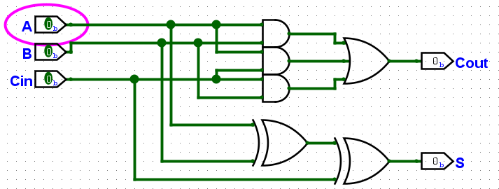

##### 搭建1位全加器2

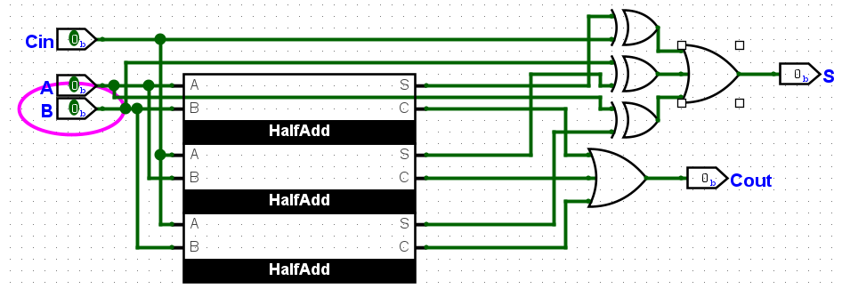

##### 搭建4位加法器

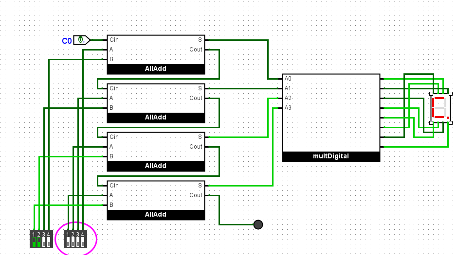

在有了前面的一位全加器之后，就可以按照套娃的形式搭建多位的加法器，这里以四位加法器作为例子展示

### 整数的机器级表示

计算机中表示负数的方式，通过一个二进制位来编码整数的符号位，剩下的二进制位用于编码整数的绝对值，这种表示称为“有符号二进制整数”，简称“有符号数”

#### 原码

原码是一种直观的编码方式, 最高位表示符号位, `0`表示正数, `1`表示负数, 其余位表示对应真值的绝对值.

考虑采用8位的RCA进行原码加法：

- 当两数皆为正数时, 通过RCA进行加法所得的结果按原码解释, 与将两数按原码解释后得到的结果在数学意义上相加, 两者一致. 因此, 在这种情况下, 可以直接通过RCA进行原码加法.
- 当两数为负时, RCA所得结果与数学意义不符, 区别在于符号位. 因此, 在这种情况下, 电路需要对符号位进行特殊处理.
- 当仅有一数为负时, RCA所得结果与数学意义不符, 不仅符号位有可能错误, 绝对值也错误. 因此, 在这种情况下, 不能使用RCA进行原码加法.

##### 搭建4位减法器

思路：根据前面的加法器，类推减法器的搭建

1. 首先写出真值表
2. 首先不考虑借位对当前的影响，类似前面的半加器
3. 再考虑结尾对当前减法的影响，类似前面的全加器
4. 再依次堆叠形成4位减法器

真值表：

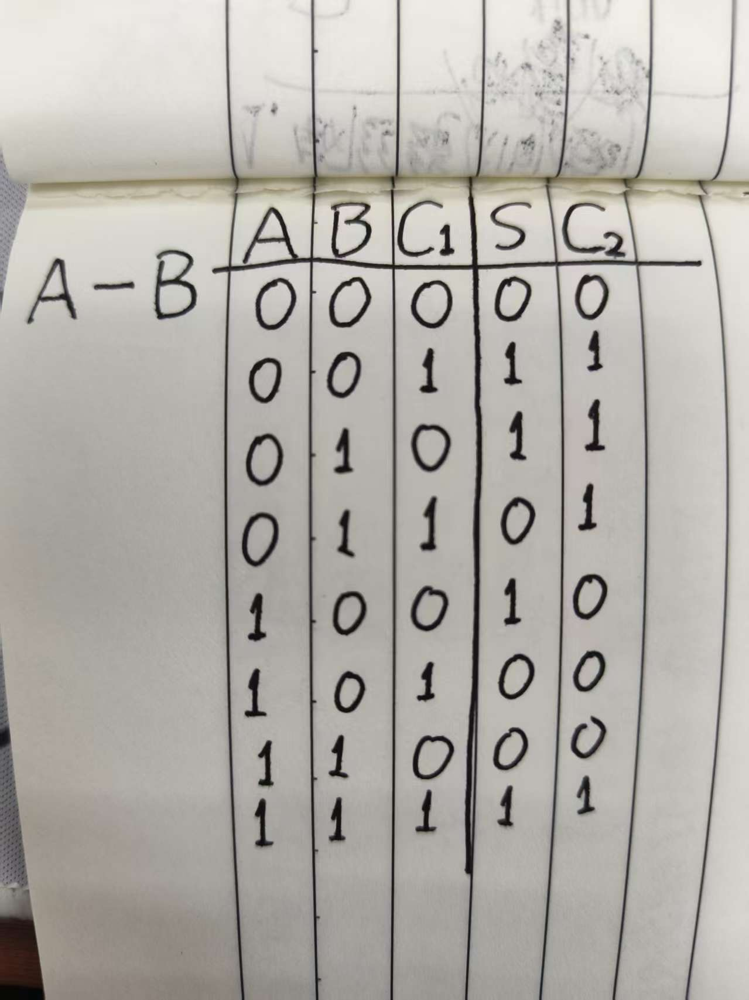

先搭建一个半减器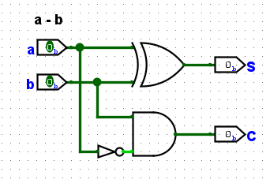

再优化成全减器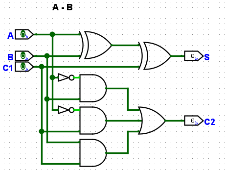

最终按照四位加法器的思路连接电路形成四位减法器：

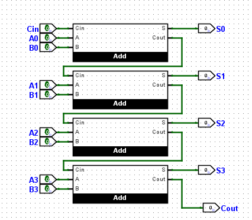

##### 搭建4位原码加法器

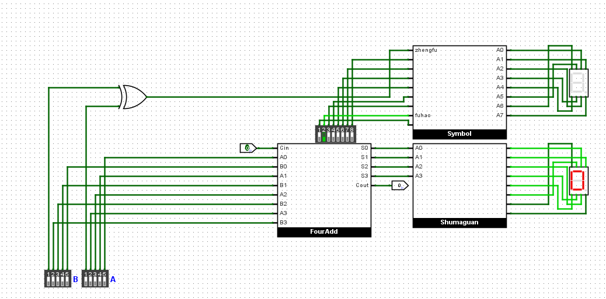

在普通的四位加法器上添加了一个符号位，实例化一个晶体管专门来表示负号。

#### 反码

反码是另一种编码方式, 它尝试解决原码加法中涉及负数的问题. 具体地, 对于正数和`0`, 其表示与原码一致; 对于负数, 其表示为相应相反数的原码的按位取反.

- 当两数皆为正数时, 通过RCA进行加法所得的结果按反码解释, 与将两数按反码解释后得到的结果在数学意义上相加, 两者一致. 因此, 在这种情况下, 可以直接通过RCA进行反码加法.
- 当有一数为负时, RCA所得结果与数学意义不符, 虽然符号位正确, 但绝对值部分不正确
- 特别地, 当互为相反数的两数相加时, 根据反码的定义, 结果总是`0b11111111`. 按反码解释, 所得结果的真值为`-0`, 如果将其看成数学意义上的`0`, 则RCA结果正确.

##### 搭建4位反码加法器

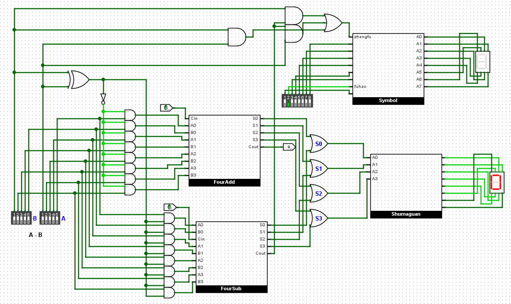

这里的输出的符号判断就比前面单纯的原码加法器要复杂，要考虑多种情况，我这里考虑了三种情况，使用了三个与门，把结果再或门连接到符号输出那里。

目前这里只是实现了RCA计算反码加法，对于-0输入尚不能处理，后续的”搭建4位反码加法器(2)“将完成-0的输入处理。

##### 搭建4位反码加法器(2)

在反码运算中，有一个神奇的规律：

如果加法运算在最高位产生了进位，你只需要把这个进位再加回到结果的最低位上，就能得到正确的反码结果

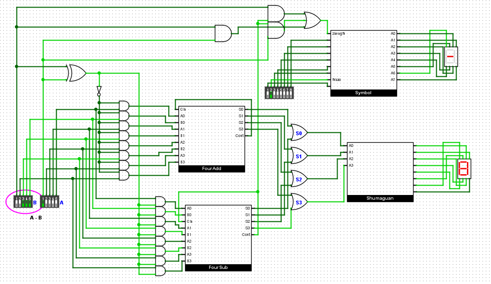

这里做的修改是把加法器和减法器的Cout重新连接回Cin，即可实现对-0等的处理.

上图显示了7 + -0 = -8

#### 补码

补码是现代计算机中常用的整数编码方式, 它进一步修复了反码计算错误时结果的偏差. 具体地, 对于正数和`0`, 其表示与原码一致; 对于负数, 其表示为相应相反数的原码的按位取反后加`1`.

这部分在入学答辩之前再仔细复习。

#### 溢出检测

回顾上文的分析, 即使是补码, 也存在编码连续但真值不连续的边界, 即`0b0111...111`和`0b1000...000`之间的边界, 它们分别表示最大数和最小数. 如果加法的计算跨越了这个边界, 计算所得结果将与数学意义不符. 特别地, 这个边界之所以存在, 是因为对于给定的二进制位数, 其表示范围总是有限的, 因此必定存在超过表示范围的数值, 使得真值的分布无法一直连续. **这种计算结果超过编码表示范围的情况, 称为"溢出"(overflow)**. 显然, 如果计算发生溢出, 则所得结果肯定与数学意义不符. 为此, 通常需要在计算加法的同时, 检测结果是否发生溢出.

- 两个正数相加，结果为负数
- 两个负数相加，结果为整数

##### 全加器的真值表：

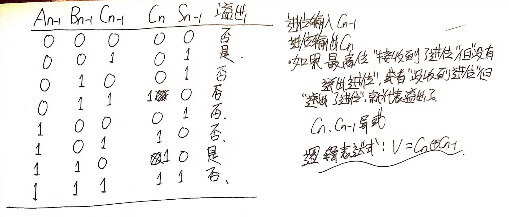

##### 测试电路

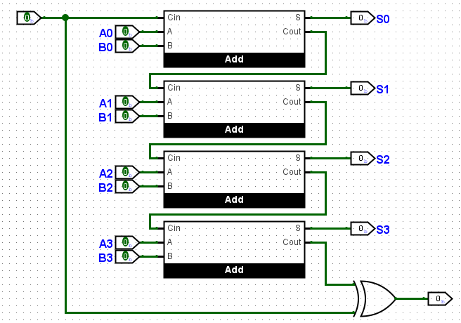

### 时序逻辑电路

它可以存储状态，其输出由当前输入和旧状态共同决定

1. 可以读出电路的旧状态
2. 可以更新电路的状态

#### 交叉配对反相器

可以存储状态的最简单电路是交叉配对反相器

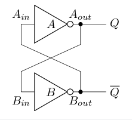

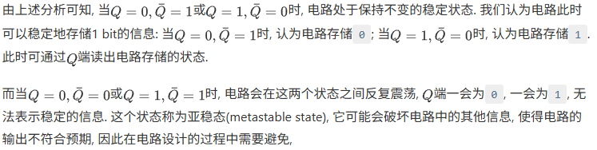

下表总结了交叉配对反相器的行为：

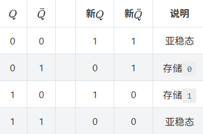

#### S-R锁存器

S-R锁存器通过将交叉配对反相器中的反相器换成或非门，来向外部提供控制功能，其中S表示Set，相应控制端用于对锁存器置位（设置为1）；R表示Reset，相应控制端用于对锁存器复位（设置为0），SR锁存器的逻辑符号和电路结构如下：

根据输入的不同，可以分为4中情况讨论SR锁存器的行为：

1. 当`S=1, R=0`时, 上方或非门的行为和反相器一致, 下方或非门的输出恒为`0`. 此时`Q`为`1`, 故将SR锁存器存储的值更新为`1`.
2. 当`S=0, R=1`时, 上方或非门的输出恒为`0`, 下方或非门的行为和反相器一致. 此时`Q`为`0`, 故将SR锁存器存储的值更新为`0`.
3. 当`S=0, R=0`时, 两个或非门的行为和反相器一致. 此时SR锁存器的行为与交叉配对反相器一致, 故SR锁存器将保持之前存储的值.
4. 当`S=1, R=1`时, 两个或非门的输出恒为`0`, 此时无法表示有效的信息. 同时, 输入从`S=1, R=1`变为`S=0, R=0`时, 相当于让交叉配对反相器进入Q = 0,~Q = 0 的状态. 根据上文的分析, 这将导致SR锁存器进入亚稳态, 因此需要避免.

SR锁存器的行为：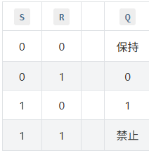

搭建S-R锁存器：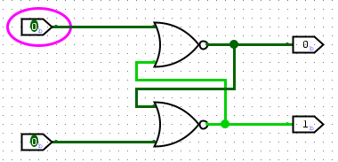

亚稳态：

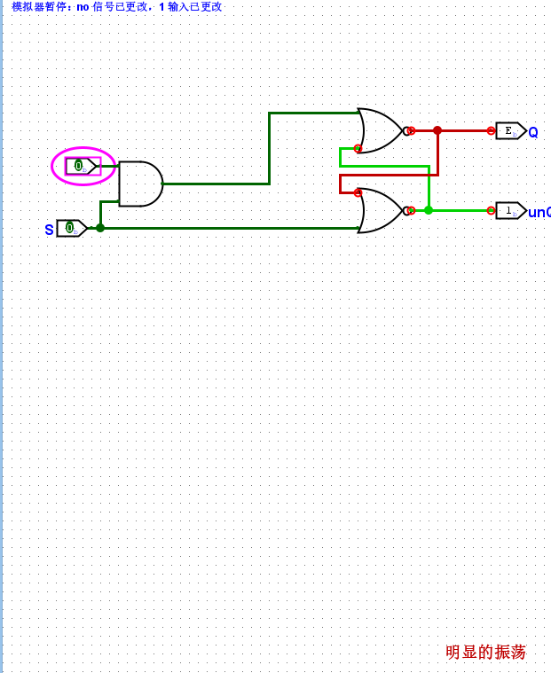

##### 用与非门搭建的SR锁存器

真值表和电路图：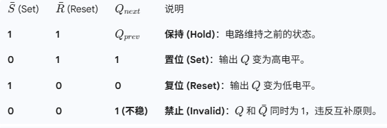

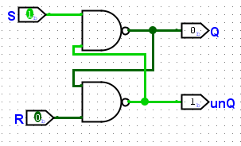

#### D锁存器

为了从源头避免亚稳态，可以在SR锁存器前添加若干门电路，将SR锁存器的4中输入限制成3中合法输入，这就是D锁存器

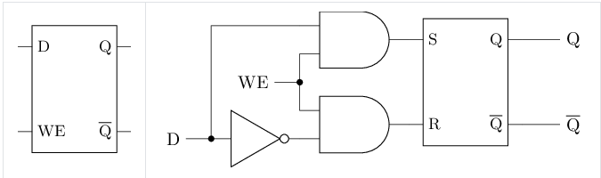

其中D为输入数据，WE为写使能(Write Enable)

##### 搭建D锁存器

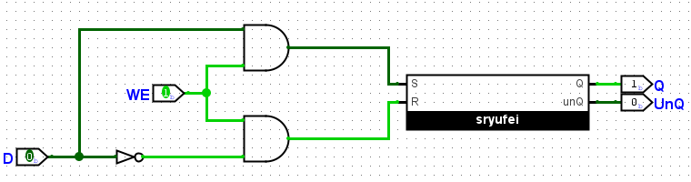

D锁存器逻辑行为分析：

- **输入限制**：通过一个非门（Inverter）连接 D，确保了进入内部 SR 锁存器的 S 和 R 信号永远不会同时为 1（或在与非门版本中同时为 0），从而从源头上避免了非法状态。

- **透明性（Transparency）**：当 WE 有效时，输出 Q 会跟随输入 D 的变化，此时锁存器就像是一根透明的导线。

- **锁存（Latch）**：当 WE 无效时，输出 Q 保持不变，无论 D 如何波动。

##### 搭建带复位功能的D锁存器

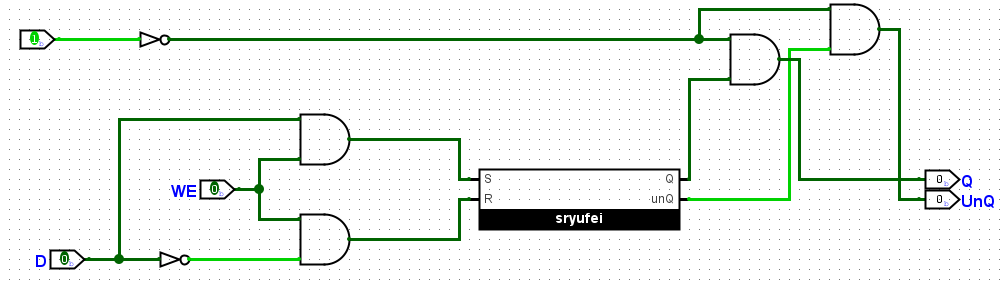

##### 用D锁存器实现位翻转功能

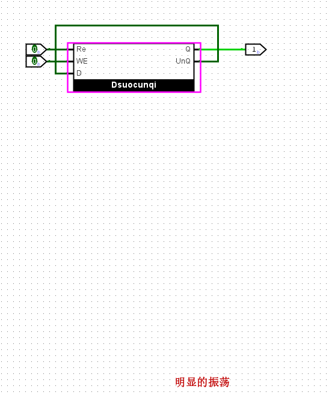

当WE为1时，电路进入了所谓的“透明模式”

- **第一步**：假设当前Q = 0， 则 ~Q = 1.
- **第二步**：由于反馈线，输入 D 瞬间变为 1。
- **第三步**：在 WE=1 时，D=1 会立即让 Q 变为 1。
- **第四步**：一旦 Q = 1，~ Q就变成了 0。反馈线又让 D 变为 0，从而导致 Q 又变回 0。

这个过程会以忽略不计的门延迟速度不断重复，从而导致最终“明显的震荡”